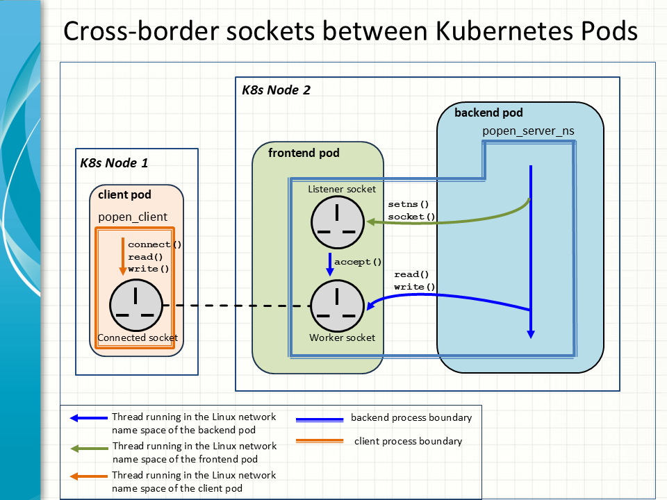

# Cross-border-sockets-between-Kubernetes-pods
A POC testbed is set up to demo the technique used by a K8s pod to open and process a TCP/IP socket within another pod on the same node, which is to be done via the Linux namespace API.

In this example, the backend pod runs 
